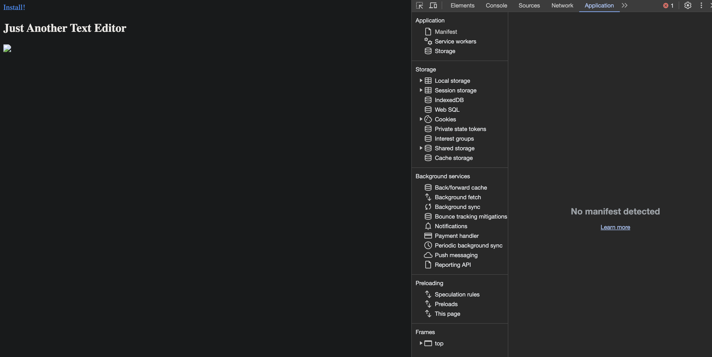

# Progressive Web Applications (PWA): Text Editor

## The Task

The task is to build a text editor that runs in the browser. The app will be a single-page application that meets the PWA criteria. Additionally, it will feature a number of data persistence techniques that serve as redundancy in case one of the options is not supported by the browser. The application will also function offline.

## User Story

```md
AS A developer
I WANT to create notes or code snippets with or without an internet connection
SO THAT I can reliably retrieve them for later use
```

## Acceptance Criteria

```md
GIVEN a text editor web application
WHEN I open my application in my editor
THEN I should see a client server folder structure
WHEN I run `npm run start` from the root directory
THEN I find that my application should start up the backend and serve the client
WHEN I run the text editor application from my terminal
THEN I find that my JavaScript files have been bundled using webpack
WHEN I run my webpack plugins
THEN I find that I have a generated HTML file, service worker, and a manifest file
WHEN I use next-gen JavaScript in my application
THEN I find that the text editor still functions in the browser without errors
WHEN I open the text editor
THEN I find that IndexedDB has immediately created a database storage
WHEN I enter content and subsequently click off of the DOM window
THEN I find that the content in the text editor has been saved with IndexedDB
WHEN I reopen the text editor after closing it
THEN I find that the content in the text editor has been retrieved from our IndexedDB
WHEN I click on the Install button
THEN I download my web application as an icon on my desktop
WHEN I load my web application
THEN I should have a registered service worker using workbox
WHEN I register a service worker
THEN I should have my static assets pre cached upon loading along with subsequent pages and static assets
WHEN I deploy to Heroku
THEN I should have proper build scripts for a webpack application
```

## Mock-Up

The following animation demonstrates what the application should function like:


The following image shows the application's `manifest.json` file:


The following image shows the application's registered service worker:


The following image shows the application's IndexedDB storage:


This is my goal! 

## Notes

Need to fix a few issues in the following files. Client folder; Webpack.config.js, src-sw.js. In the js folder they are database.js, install.js. npm run start does not appear to produce results. Figure out why. Something is not working in the code. Or maybe some things are working and I just don't realize it. Will look at it again sometime after November 15 when I have more time and I'm in no pressure to complete assignments by Nov 15 and to prepare for a 3rd and final project. Stay tuned! 

## Usage

The following images show the current web application's appearance and functionality. Keep in mind this is a work in progress, it is NOT complete yet (see Notes above).

 

## Installation

N/A

## Links

[Repository](https://github.com/Gera1313/19-text-editor)

[Deployed Link](Insert here when available)

## Credits

Big help thanks to the module activities especially module 19. Spent an entire weekend studying module 19. Watched the Zoom recordings. Still wasn't enough, but will continue with this project at a later time when I'm not pressed with time (see Notes section above).

[This site helped](https://web.dev/codelab-make-installable/)

## Licenses

MIT License

